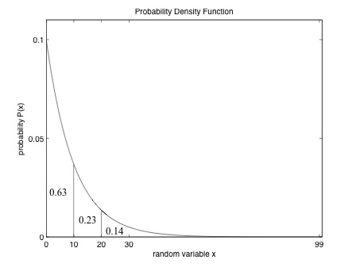

# Adaptive Process Scheduling in XINU

## Overview

This project explores advanced process scheduling techniques in the Xinu operating system to address the issue of **starvation** and optimize CPU utilization. Traditional priority-based schedulers suffer from starvation, where low-priority processes get indefinitely delayed. To mitigate this, I have implemented two **adaptive scheduling policies**:

- **Exponential Distribution Scheduler (EXPDISTSCHED)** - introduces randomness using an exponential distribution to ensure fairness.
- **Linux-like Scheduler (LINUXSCHED)** - mimics early Linux scheduling strategies by dynamically adjusting process time slices based on priority and execution history.

Through this project, I aimed to deepen my understanding of context switching, process priority management, and scheduling algorithms, while also exploring mathematical models like the exponential distribution for scheduling fairness.

## Background Concepts

### Process Scheduling
Process scheduling is the mechanism by which an operating system decides which process runs at a given time. Traditional schedulers often employ **fixed priority** schemes, where higher-priority processes dominate CPU execution, causing **starvation** for lower-priority processes.

To overcome this, modern operating systems employ **dynamic scheduling** techniques that adjust process execution dynamically based on various parameters like **execution history, waiting time, and randomness**.

### Starvation in Priority Scheduling
In a strict priority-based scheduler, lower-priority processes may never execute if high-priority processes continuously enter the ready queue. This leads to **starvation**, where some processes remain indefinitely blocked. Addressing starvation requires **fairness mechanisms** like:
- Aging (gradually increasing priority of waiting processes)
- Probabilistic selection of processes
- Dynamic time quantum allocation

## Implemented Scheduling Policies

### 1. Exponential Distribution Scheduler (`EXPDISTSCHED`)
This scheduler selects the next process based on a random number generated using the **exponential distribution**, ensuring that lower-priority processes get a fair chance to execute.



**How it Works:**
- A random number is generated following the exponential distribution.
- The process with the lowest priority greater than the random number is selected.
- If the generated value is below the minimum priority in the queue, the lowest-priority process is chosen.
- If it exceeds the maximum priority, the highest-priority process is picked.
- Within the same priority group, round-robin scheduling ensures fairness.

**Mathematical Model:**
The probability of selecting a process with priority x follows:
$F(x;\lambda) = 1 - e^{-\lambda x}$ where $\lambda$ controls the decay rate, influencing how often lower-priority processes are chosen.

**Implementation Details:**
The function `expdev(λ)` generates exponentially distributed random numbers using:
```c
 double expdev(double lambda) {
    double dummy;
    do {
        dummy = (double) rand() / RAND_MAX;
    } while (dummy == 0.0);
    return -log(dummy) / lambda;
 }
```
Since Xinu lacks built-in floating-point math libraries, I implemented custom versions of `log()` and `pow()`.

---

### 2. Linux-like Scheduler (`LINUXSCHED`)
This scheduler models the **Linux 2.2 kernel scheduling policy**, using **epoch-based time slice allocation**. It dynamically adjusts process execution time based on priority and **remaining CPU time from previous epochs**.

**Epoch-Based Scheduling:**
- Each process receives a **time quantum** based on its priority.
- When a process exhausts its quantum, it cannot execute until the next epoch.
- If a process doesn’t fully utilize its quantum, half of the remaining time is carried over to the next epoch.

**Process Selection:**
- A dynamic **goodness value** determines process priority within an epoch:
  \[ \text{goodness} = \text{remaining quantum} + \text{priority} \]
- The process with the highest **goodness value** runs next.
- If multiple processes have the same goodness, round-robin scheduling is used.

This strategy ensures that CPU-intensive processes don’t **monopolize** execution while still prioritizing high-priority tasks efficiently.

---
## Implementation Details

### Scheduler Management Functions
I added the following functions for runtime scheduler selection:
```c
void setschedclass(int sched_class);  // Set scheduling policy
int getschedclass();  // Get current scheduler type
```
Defined scheduling policies:
```c
#define EXPDISTSCHED 1
#define LINUXSCHED 2
```

---

## Running XINU with QEMU

### Prerequisites
Before executing XINU, ensure you have the necessary dependencies installed on your system:

- QEMU (for emulating the XINU environment)
GCC (GNU Compiler Collection) with support for i386 architecture
GNU Make (to build the project)
If not installed, you can install them using:

```
sudo apt update
sudo apt install qemu-system-i386 gcc make
```

### Building XINU

To compile XINU, navigate to the `compile` folder and run:
```
make
```

This will generate the `xinu.elf` binary, which serves as the kernel image.

### Running XINU in QEMU
Once compiled, you can execute XINU using QEMU with the following command:
```
make run
```
This command launches XINU inside a QEMU virtual machine in a non-graphical mode.

To exit the QEMU console, press: `Ctrl + A, then X`

### Debugging with QEMU
To run XINU in debug mode, which allows remote debugging via GDB:
```
make debug
```
This will start QEMU in debugging mode, waiting for a GDB connection on port 1234.

To attach GDB for debugging, open a new terminal and run:
```
gdb
```
Then, inside GDB:
```
target remote localhost:1234
```
This will allow you to set breakpoints and step through the execution of XINU.

### Cleaning the Build
If you need to clean the build and recompile, use:
```
make clean
```
This removes compiled binaries and temporary files.

---

## Conclusion
This project deepened my understanding of **OS scheduling mechanisms** and the mathematical foundations of **probabilistic scheduling**. The integration of **exponential distributions** and **epoch-based scheduling** provided practical insights into how modern OS schedulers mitigate starvation and ensure fairness. Future improvements could involve **priority aging**, **ML-based dynamic scheduling**, or **real-time constraints** to enhance scheduling efficiency further.

